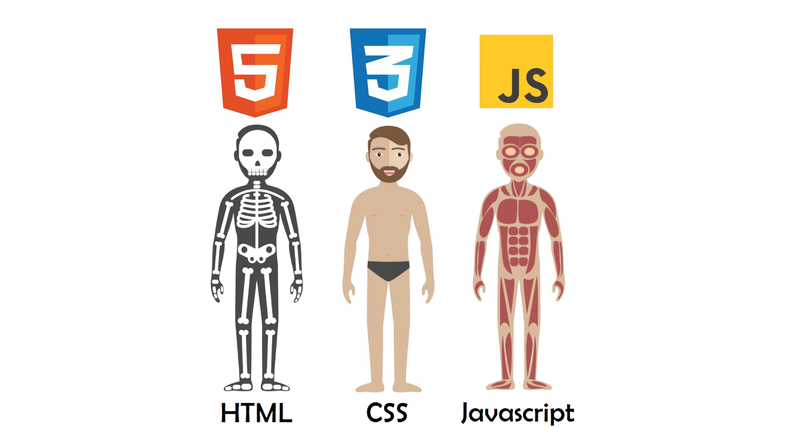

# BoraEstudarGalera

<h1 align="center">
  
  
</h1>

<h1 align="center"> HTML </h1>

 Uma linguagem de marcação, e não programação, ou seja, usada para definir a estrutura do seu conteúdo. HTML consiste de uma série de [elementos] que você usa para delimitar ou agrupar diferentes partes do conteúdo para que ele apareça ou atue de determinada maneira. As [tags] anexas podem transformar uma palavra ou imagem num hiperlink, pode colocar palavras em itálico, pode aumentar ou diminuir a fonte e assim por diante.
Assim como nosso esqueleto nos dá suporte e estrutura, o HTML fornece a base essencial para os sites e páginas da web, permitindo que textos, imagens e vídeos se encaixem harmoniosamente. 

<h1 align="center"> CSS3 </h1>

 Agora, o CSS3 é como as roupas elegantes e coloridas que usamos para nos destacar na multidão. Com o CSS3, podemos mudar as cores, as formas e até mesmo o tamanho de tudo em nossa página da web, tornando-a bonita e atraente para quem a visita.
Então, quando você vê um site com cores incríveis, botões elegantes e um layout bem organizado, lembre-se de que o CSS3 desempenha um papel importante, assim como as roupas fazem com que as pessoas se destaquem e expressem sua personalidade. É uma ferramenta mágica que ajuda a dar vida e estilo à internet, tornando-a um lugar mais bonito e interessante para todos nós! 

<h1 align="center"> JS </h1>

 JavaScript, frequentemente abreviado como JS, é como o músculo do corpo da internet! Assim como os músculos nos permitem mover e realizar diferentes ações com nosso corpo, o JavaScript nos permite dar vida e fazer coisas incríveis acontecerem em uma página da web.
Ele funciona no lado do usuário da web, o que significa que é executado no computador ou dispositivo da pessoa que está navegando na internet. Imagine que você está interagindo com uma página da web, clicando em botões, preenchendo formulários ou jogando um jogo online. O JavaScript é o "cérebro" por trás dessas ações.
Você pode pensar no JavaScript como um conjunto de instruções que diz à página da web o que fazer quando algo acontece, como quando você clica em um botão. É como mágica digital! E a melhor parte é que o JavaScript é uma linguagem que não é difícil de aprender, mas é muito poderosa.

Aqui temos sites que eu acho pertinentes, que me ajudaram para estudar para isso.

# Aulas / Dicas de Estudo
[Estudo de HTML 5 e CSS3 por Curso em Vídeo](https://youtube.com/playlist?list=PLHz_AreHm4dkZ9-atkcmcBaMZdmLHft8n&si=h8U_FWOTycdp0yFv) 
 
[Caminho para desenvolvimento web](https://youtu.be/naZDkZukB-g?si=-Qfz_OxusaRGRD3J) 
 
[Aula com projeto por Hora de Codar](https://youtu.be/yvCAX68TJMc?si=iclZ7rg99Yg7o40h) 
 
[Curso de Front-End por Rocketseat](https://www.rocketseat.com.br/discover) 
 

# Projetos

[Diversos projetos por Rocketseat](https://youtube.com/playlist?list=PL85ITvJ7FLohTZv9cC5-PrZ39Q3cugWqp&si=dXJQRFuq1friCIKU) 
 

### Apenas HTML5 & CSS3

[Portfolio HTML5 & CSS3 por Adriana Saty](https://youtu.be/n_Etdr7Dbjs)  
 
[Landing Page HTML5 & CSS3 por Alexandre Saints](https://youtu.be/edDCEK5QWE8)  
 
[Design de Tela de login com responsividade HTML5 & CSS3 por Markzuel](https://youtu.be/69-WfrVBli8)  
 

### HTML5, CSS3 & JS
[Projeto de Gerador de Senhas HTML5, CSS3 & JS por Sujeito Programador](https://www.youtube.com/watch?v=i6t2jaRxos4)  
 
[Projeto de Calculadora de IMC HTML5, CSS3 & JS por Larissa Kich](https://youtu.be/UBYqkpsafyI)  
 
[Projeto de criar o Mario com HTML5 CSS3 & JS por Manual do Dev](https://www.youtube.com/watch?v=r9buAwVBDhA&t=194s&pp=ygURcHJvamV0byBmcm9udC1lbmQ%3D)  
 

# Entrar em contato
[Sinta-se a vontade para me chamar no Instagram](https://www.instagram.com/devduque/)
